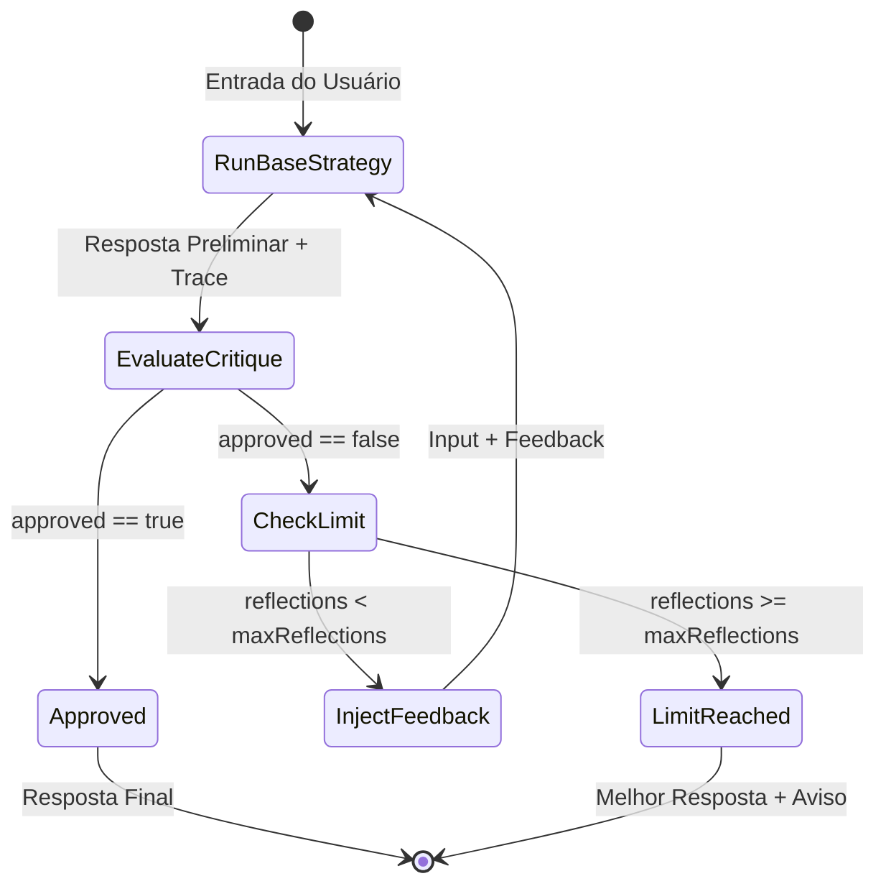

# Data Model: Camada de Reflection para Estratégias de Raciocínio

**Date**: 2026-09-11 | **Spec**: [spec.md](spec.md)

Esta funcionalidade opera estritamente na camada de raciocínio em memória (TypeScript puro / agente LangGraph/LangChain), sem novas entidades de banco de dados no MySQL.

## Tipos e Interfaces de Domínio

### CritiqueResult

Estrutura emitida pelo componente crítico em cada ciclo de validação.

```typescript
export interface CritiqueResult {
  /** Se a resposta candidata é consistente com as evidências do trace e atende ao objetivo. */
  approved: boolean;
  /** Instruções corretivas ou justificativa da aprovação. */
  feedback: string;
}
```

Validação Zod na fronteira de saída estruturada do LLM:
```typescript
export const critiqueSchema = z.object({
  approved: z
    .boolean()
    .describe("true se a resposta for factualmente consistente com as evidências e resolver o objetivo; false caso contrário."),
  feedback: z
    .string()
    .min(1)
    .describe("Instruções corretivas claras se approved for false, ou justificativa concisa se true."),
});
```

### ReflectionOptions

Opções de configuração da função decoradora `withReflection`.

```typescript
export interface ReflectionOptions {
  /** Número máximo de ciclos de crítica e regeneração. Default: 2. */
  maxReflections?: number;
  /** Nome customizado para a estratégia decorada. Default: `reflect:${strategy.name}`. */
  name?: string;
}
```

### TraceEvent (Evolução)

O tipo `TraceEvent` já suporta eventos do tipo `"critique"`:
```typescript
export type TraceEvent =
  | { type: "thought" | "observation" | "critique"; content: string }
  | { type: "action"; tool: string; args: unknown }
  | { type: "plan"; steps: string[] }
  | { type: "answer"; content: string };
```

Para a camada de reflexão, o conteúdo do evento `critique` é padronizado como:
- `[APROVADO] {feedback}` quando `approved === true`.
- `[REPROVADO] {feedback}` quando `approved === false`.
- `[LIMITE ATINGIDO] Máximo de reflexões ({N}) atingido.` quando o ciclo é encerrado por limite.

## Ciclo de Vida e Transições de Estado


