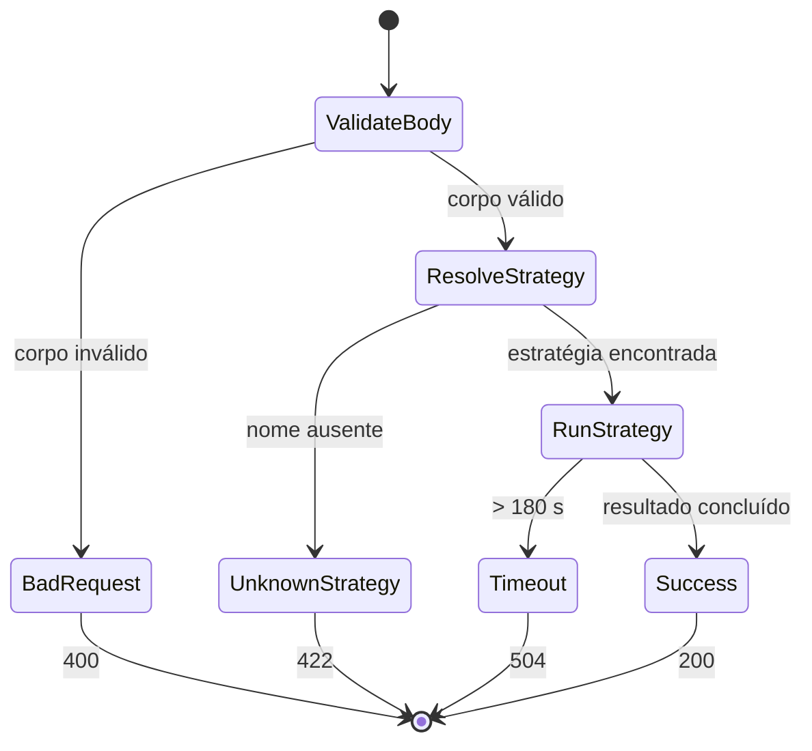

# Data Model: Endpoint de Chat Operacional

**Date**: 2026-09-14 | **Spec**: [spec.md](spec.md)

A feature não introduz persistência. Seus dados vivem durante a requisição HTTP e reutilizam o contrato de resultado das estratégias.

## ChatRequest

| Campo | Tipo | Regras |
|---|---|---|
| message | string | obrigatório; remoção de espaços; mínimo de 1 caractere |
| strategy | string | opcional; remoção de espaços; mínimo de 1 caractere; default `react` |
| reflect | boolean | opcional; default `false`; não aceitar coerção de strings ou números |

## ChatResponse (200)

| Campo | Tipo | Origem |
|---|---|---|
| answer | string | `StrategyResult.answer` |
| trace | TraceEvent[] | `StrategyResult.trace`, na ordem de execução |
| metrics | Metrics | `StrategyResult.metrics` |

## ErrorResponse

| Status | Estrutura | Regra |
|---|---|---|
| 400 | `{ issues: ZodIssue[] }` | Corpo ausente, JSON inválido ou incompatível com `ChatRequest` |
| 422 | `{ error: { code: "UNKNOWN_STRATEGY", message: string } }` | Nome não presente no registry |
| 504 | `{ error: { code: "CHAT_TIMEOUT", message: string } }` | Estratégia não concluiu em 180 segundos |

## StrategyRegistry

```text
StrategyRegistry
├── resolve(name: string, reflect: boolean): ReasoningStrategy | undefined
└── names(): readonly string[]
```

Regras:
- O registry padrão possui `react` e `plan-and-execute`.
- `resolve(..., false)` retorna a estratégia base registrada.
- `resolve(..., true)` retorna a estratégia base decorada com reflexão.
- O registry é injetável; o teste pode fornecer uma implementação fake sem LLM.

## Transição da Requisição

