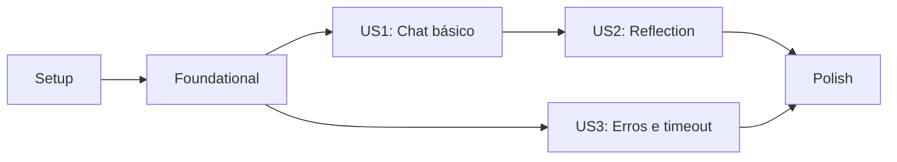

# Tasks: Endpoint de Chat Operacional

**Input**: Artefatos de design de [specs/003-chat-endpoint](.)
**Prerequisites**: [plan.md](plan.md), [spec.md](spec.md), [research.md](research.md), [data-model.md](data-model.md), [contracts/chat-http.md](contracts/chat-http.md), [quickstart.md](quickstart.md)

**Tests**: Teste de integração é obrigatório pela constituição do projeto e pelo requisito explícito da feature. Todos os testes devem ser determinísticos, sem rede externa nem credenciais.

## Phase 1: Setup (Shared Infrastructure)

**Purpose**: Preparar os contratos compartilhados que suportam a rota e os testes injetáveis.

- [X] T001 Criar a interface `StrategyRegistry` e a fábrica injetável `createStrategyRegistry` em [src/agents/index.ts](../../src/agents/index.ts)
- [X] T002 Registrar as estratégias base `react` e `plan-and-execute` no registry padrão em [src/agents/index.ts](../../src/agents/index.ts)
- [X] T003 [P] Definir os tipos Zod de `ChatRequest` e respostas de erro em [src/http/server.ts](../../src/http/server.ts)

---

## Phase 2: Foundational (HTTP Boundary)

**Purpose**: Criar a fábrica da aplicação Express, a fronteira de validação e o mecanismo reutilizável de timeout.

**⚠️ CRITICAL**: Esta fase precisa ser concluída antes de implementar os fluxos de usuário HTTP.

- [X] T004 Criar `createChatServer` injetável com `express.json()` em [src/http/server.ts](../../src/http/server.ts)
- [X] T005 Implementar helper `runWithTimeout` com limite padrão de 180000 ms e erro de domínio específico em [src/http/server.ts](../../src/http/server.ts)
- [X] T006 Atualizar tradução de erros de domínio para incluir timeout de chat em [src/errors.ts](../../src/errors.ts)

**Checkpoint**: A borda Express pode receber JSON e executar dependências injetadas, mas ainda não expõe todo o contrato `POST /chat`.

---

## Phase 3: User Story 1 - Enviar uma solicitação operacional ao OpsPilot (Priority: P1) 🎯 MVP

**Goal**: Entregar `POST /chat` para mensagens válidas, com `react` como estratégia padrão e resposta `200` no formato completo da estratégia.

**Independent Test**: Iniciar `createChatServer` com registry fake, enviar `POST /chat` contendo somente `{ "message": "status" }` e verificar `200` com `answer`, `trace`, `metrics`, além de confirmar que o registry recebeu `react` e `reflect: false`.

### Tests for User Story 1

- [X] T007 [US1] Criar harness de teste HTTP local e registry fake determinístico em [src/http/server.test.ts](../../src/http/server.test.ts)
- [X] T008 [US1] Adicionar teste de `POST /chat` com body válido usando a estratégia padrão e validar resposta `200` em [src/http/server.test.ts](../../src/http/server.test.ts)
- [X] T009 [US1] Adicionar teste de estratégia registrada explicitamente no body em [src/http/server.test.ts](../../src/http/server.test.ts)

### Implementation for User Story 1

- [X] T010 [US1] Implementar resolução de estratégia base por nome no registry em [src/agents/index.ts](../../src/agents/index.ts)
- [X] T011 [US1] Implementar handler `POST /chat` com validação Zod, defaults e resposta `{ answer, trace, metrics }` em [src/http/server.ts](../../src/http/server.ts)
- [X] T012 [US1] Conectar a inicialização do processo à aplicação HTTP e configurar a porta em [src/index.ts](../../src/index.ts)

**Checkpoint**: `POST /chat` atende a solicitação válida e pode ser testado isoladamente com fake, sem rede externa.

---

## Phase 4: User Story 2 - Solicitar uma resposta revisada por reflexão (Priority: P2)

**Goal**: Permitir `reflect: true` no body para que o registry aplique a camada `withReflection` à estratégia base selecionada.

**Independent Test**: Com registry fake que observa os argumentos de resolução, enviar `{ "message": "status", "strategy": "react", "reflect": true }` e verificar execução da estratégia refletida e retorno `200`.

### Tests for User Story 2

- [X] T013 [US2] Adicionar teste de integração para `reflect: true` verificando a resolução refletida no registry fake em [src/http/server.test.ts](../../src/http/server.test.ts)
- [X] T014 [US2] Adicionar teste de integração para `reflect` omitido e `reflect: false` em [src/http/server.test.ts](../../src/http/server.test.ts)

### Implementation for User Story 2

- [X] T015 [US2] Aplicar `withReflection` à estratégia resolvida quando `reflect` for verdadeiro em [src/agents/index.ts](../../src/agents/index.ts)

**Checkpoint**: O endpoint suporta as versões base e refletida da mesma estratégia sem alterar o contrato de resposta.

---

## Phase 5: User Story 3 - Receber erros HTTP acionáveis (Priority: P3)

**Goal**: Garantir respostas contratuais para body inválido (`400`), estratégia desconhecida (`422`) e timeout (`504`).

**Independent Test**: Exercitar o endpoint injetado com payload inválido, nome não registrado e estratégia fake pendente, verificando status/corpo de cada falha sem rede externa.

### Tests for User Story 3

- [X] T016 [P] [US3] Adicionar testes de integração para `400` e `issues` de Zod em [src/http/server.test.ts](../../src/http/server.test.ts)
- [X] T017 [P] [US3] Adicionar teste de integração para `422 UNKNOWN_STRATEGY` em [src/http/server.test.ts](../../src/http/server.test.ts)
- [X] T018 [US3] Adicionar teste de integração de `504 CHAT_TIMEOUT` usando timeout injetado curto em [src/http/server.test.ts](../../src/http/server.test.ts)

### Implementation for User Story 3

- [X] T019 [US3] Retornar `400` com `issues` para JSON/body incompatível com `ChatRequest` em [src/http/server.ts](../../src/http/server.ts)
- [X] T020 [US3] Retornar `422` com código `UNKNOWN_STRATEGY` e nome solicitado em [src/http/server.ts](../../src/http/server.ts)
- [X] T021 [US3] Retornar `504` com código `CHAT_TIMEOUT` quando `runWithTimeout` exceder o limite em [src/http/server.ts](../../src/http/server.ts)

**Checkpoint**: Todas as falhas de contrato são previsíveis, testadas e não expõem detalhes internos.

---

## Phase 6: Polish & Cross-Cutting Validation

**Purpose**: Validar contrato, integração do processo e qualidade geral.

- [X] T022 [P] Ajustar [specs/003-chat-endpoint/quickstart.md](quickstart.md) caso os comandos de inicialização/porta definitivos diferenciem do plano
- [X] T023 Executar `npm run typecheck` e corrigir erros relacionados nos arquivos [src/agents/index.ts](../../src/agents/index.ts), [src/http/server.ts](../../src/http/server.ts) e [src/index.ts](../../src/index.ts)
- [X] T024 Executar `npm run test` e confirmar a suíte de integração em [src/http/server.test.ts](../../src/http/server.test.ts) sem rede externa
- [X] T025 Executar manualmente os cenários de sucesso e falha do [quickstart.md](quickstart.md) contra o servidor local

---

## Dependencies & Execution Order

### Phase Dependencies

- **Setup (Phase 1)**: Pode iniciar imediatamente.
- **Foundational (Phase 2)**: Depende de T001-T003 e bloqueia as histórias HTTP.
- **US1 (Phase 3)**: Depende de Phase 2; é o MVP.
- **US2 (Phase 4)**: Depende do registry/handler de US1.
- **US3 (Phase 5)**: Depende da borda de Phase 2; pode ser desenvolvida em paralelo com US2 após US1, sem conflito de arquivos se coordenada.
- **Polish (Phase 6)**: Depende da conclusão das histórias selecionadas.

### User Story Dependencies

- **US1 (P1)**: Independente e suficiente para entregar o MVP.
- **US2 (P2)**: Requer a resolução de estratégias da US1.
- **US3 (P3)**: Requer a rota e o helper de timeout; não depende da reflexão.

## Parallel Opportunities

- Após T001, o schema de `ChatRequest` (T003) pode ser trabalhado em paralelo com o registro das estratégias padrão (T002).
- Os testes `400` (T016) e `422` (T017) são casos independentes, embora editem o mesmo arquivo e devam ser serializados por um único implementador.
- Após US1, as tarefas de US2 e os testes de US3 podem ser distribuídos para pessoas diferentes; a implementação final no `server.ts` exige integração sequencial.
- T022 pode acontecer em paralelo com T023/T024.

## Implementation Strategy

### MVP First

1. Concluir T001-T006 para criar registry, borda e timeout.
2. Escrever T007-T009 antes da implementação da US1.
3. Implementar T010-T012 e executar o teste de integração da US1.
4. Demonstrar `POST /chat` com `{ "message": "status" }` como primeiro incremento funcional.

### Incremental Delivery

1. US1 expõe a rota com estratégia padrão e selecionável.
2. US2 acrescenta reflexão sob comando explícito do consumidor.
3. US3 fecha o contrato de erros e timeout.
4. Phase 6 confirma os comandos, tipos e testes do projeto inteiro.

## Format Validation

Todas as 25 tarefas usam checkbox, identificador sequencial, rótulo de história quando pertencem a uma user story e caminho exato do arquivo a modificar ou validar.
